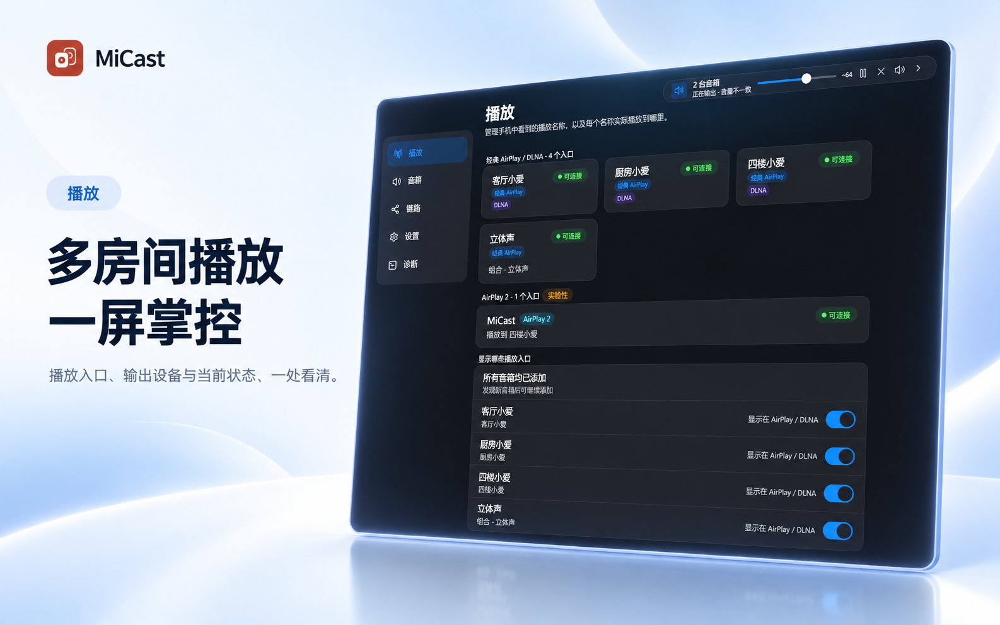
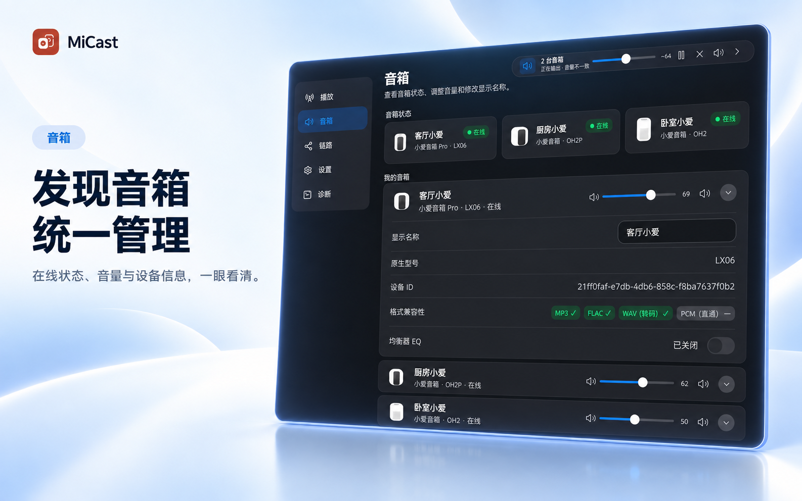
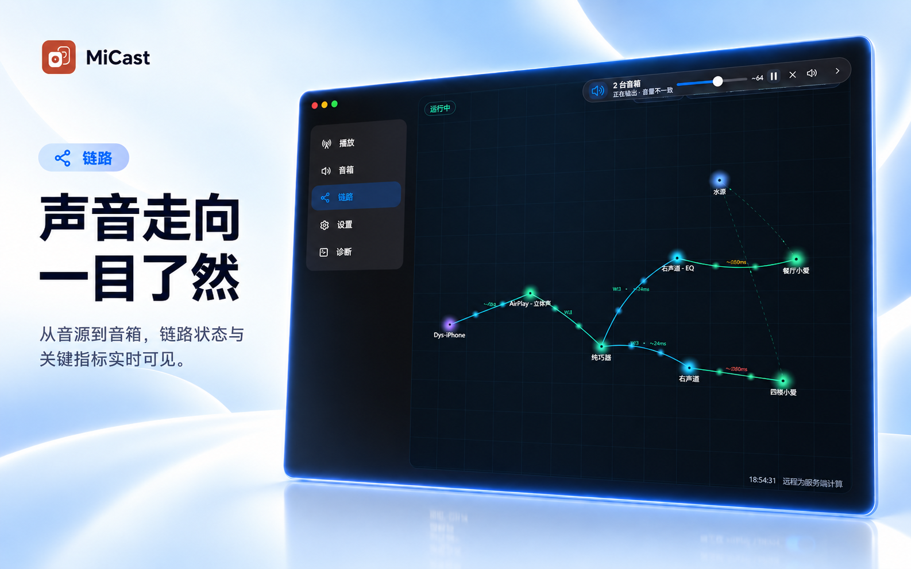
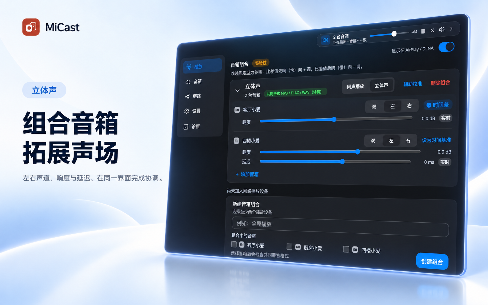

<p align="center"></p>
<h1 align="center">MiCast</h1>
<p align="center">把手机、电脑上的音频投放到一台或多台小米智能音箱。<br>支持跨型号组播、多音箱同步和立体声组合，通过 AirPlay / DLNA 即连即播。</p>

<p align="center">
  
  
</p>

## 核心能力

- **AirPlay 接收**：提供经典 AirPlay 入口，把 iPhone、iPad 或 Mac 的音频送到小米音箱。
- **多音箱同步**：同一音源可同声播放到多台音箱（支持跨型号），并可逐台校准延迟、响度、音量与静音。
- **立体声组合**：两台音箱分配为左、右声道，实时拆分并同步输出。
- **逐台调音**：每台音箱独立的 EQ 曲线、预设、夜间模式与等响度补偿。
- **AirPlay 2**：飞牛原生包与 Docker 编排版提供一个可选的 AirPlay 2 入口（实验性，可在引导或设置中调整）。

## 界面预览

<p align="center">
  
  
</p>
<p align="center">
  
  
</p>
<p align="center">
  
</p>
<p align="center">
  
</p>

## 更多功能

- DLNA 播放入口，以及局域网内 AirPlay / DLNA 播放设备的发现与投放
- MP3、FLAC、WAV 实时编码，可关闭转码走 PCM 直通；逐台学习音箱支持的格式
- 米家二维码登录、音箱发现、播放状态与音量控制
- 登录态自动续期：后台轮换云端短期凭证，一次登录长期有效
- 带屏音箱显示封面与滚动歌词
- 链路拓扑、连接检查、测试音频、运行日志与诊断报告导出
- 响应式 Web 管理界面、浅色 / 深色主题与移动端适配

## 工作方式

```text
iPhone / iPad / Mac / DLNA 客户端
                 │
                 ▼
        AirPlay / AirPlay 2 / DLNA
                 │ PCM
                 ▼
          MiCast 编码与路由
                 │
          ┌──────┴──────┐
          ▼             ▼
       单台音箱    同声组合 / 立体声组合
```

接入方式、编码、延迟与同步的完整说明见[音频怎么走](docs/audio-path.md)。

## Windows

运行构建好的 `MiCast.exe`，或从源码启动：

```powershell
.\scripts\start-local.cmd
```

安装版把设置保存在 `%APPDATA%\MiCast`，日志和运行文件保存在 `%LOCALAPPDATA%\MiCast`；便携版压缩包内含 `portable.flag`，所有数据保存在程序目录旁的 `data` 文件夹。源码运行使用 `%APPDATA%\MiCast-Dev`。

首次打开后按页面引导设置管理访问方式并连接米家。Windows 版提供经典 AirPlay 与 DLNA 接收。

同时构建便携压缩包与安装版（安装版需要 Inno Setup 6）：

```powershell
pwsh -NoProfile -File scripts/build-windows-distributions.ps1
```

## 飞牛 fnOS

原生 `.fpk` 使用 fnOS 统一网关 `/app/micast/`，依赖应用中心的 Python 3.12，提供经典 AirPlay、DLNA，以及一个可选的实验性 AirPlay 2 入口（x86 包内置其运行时，ARM 包不含）。

```powershell
pwsh -NoProfile -File scripts/build-fnos.ps1
```

安装包输出到 `dist/fnos/`。详细结构见 [fnOS 原生包说明](packaging/fnos/README.md)。

## Docker

提供经典版单容器镜像；AirPlay 2 单例版与多实例编排为实验性。构建、环境变量与网络要求见 [`docker/README.md`](docker/README.md)。

## 源码开发

需要 Python 3.11+、Node.js 20+。

```powershell
python -m venv .venv
.\.venv\Scripts\python.exe -m pip install -e ".[dev]"
npm --prefix web ci
npm --prefix web run build
.\.venv\Scripts\python.exe -m micast
```

质量检查：

```powershell
.\.venv\Scripts\python.exe -m ruff check micast tests
.\.venv\Scripts\python.exe -m pytest
npm --prefix web test
npm --prefix web run typecheck
npm --prefix web run build
```

## 登录态自动续期

小米云端播放接口使用约 30 天有效的短期凭证（serviceToken）。MiCast 会在后台定期用登录时保存的长期凭证（passToken）向小米账号服务静默换取新的 serviceToken，日常使用无需重新登录。

- 续期只与小米账号服务器通信，不向音箱发送指令，不影响正在播放的内容。
- 凭证在本地加密存储；续期遇到网络异常会保留旧凭证并自动重试。只有小米明确拒绝长期凭证（账号改密、设备被移除等）时才会提示重新登录。

## 网络

MiCast 使用 mDNS 与 SSDP 发现局域网设备，需要允许应用访问专用网络。音频入口的端口由运行时分配，默认端口与网络要求见[部署说明](docs/deployment.md)。

## 项目结构

```text
assets/      品牌源文件与各平台图标
micast/      Python 服务、接收器、编码与路由
web/         TypeScript 管理界面
docker/      容器构建与编排配置
packaging/   Windows 与 fnOS 打包配置
scripts/     启动、构建和运维脚本
tests/       自动化测试
```

完整文档入口：[docs/README.md](docs/README.md)。

## 致谢

本项目在开发过程中参照了以下开源项目：

- [shairport-sync](https://github.com/mikebrady/shairport-sync) — 飞牛 fnOS 包中 AirPlay 2 入口的运行时。
- [MiService（miservice-fork）](https://github.com/yihong0618/MiService) — 米家账号登录与音箱控制接口的实现参考。
- [python-miio](https://github.com/rytilahti/python-miio) — 小米设备通信协议与设备发现的参考。

## License

[MIT](LICENSE)
