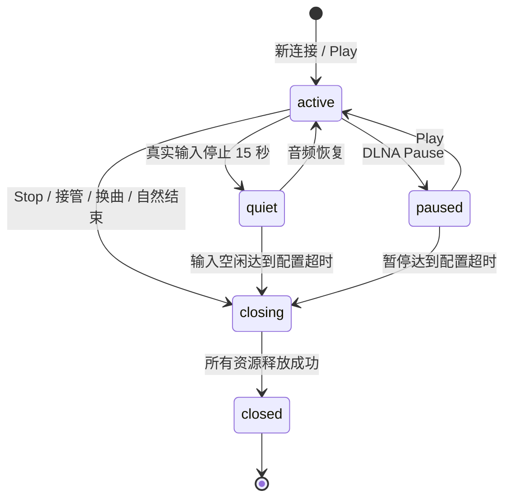

# 播放会话与连接生命周期

## 资源边界

接收器和音频管道是服务资源，可以在无人投放时保留。手机控制连接、音箱 HTTP 请求、云端播放归属、DLNA 代理和转码线程是会话资源，必须挂在 `PlaybackSessions` 中的一次会话代次上。`AudioBridge._active_sessions` 仅为注册表的兼容视图，不再独立维护状态。

注册表位于 `micast/playback_sessions.py`。协议适配器负责报告输入活动、注册资源的释放动作；注册表负责状态转换、清理时机和失败重试。音频健康监督器只负责有效会话的播放恢复，不再决定会话何时结束。

## 状态与时序

- 每 2 秒检查生命周期。空闲判定取经典 AirPlay 的 RTP 到达时间或 AirPlay 2 的真实 PCM 输入时间；编码输出、补静音、控制回调、音箱保持连接均不能作为输入活跃证据。
- 输入空闲 15 秒进入 quiet，给快速恢复 3 秒宽限后释放输出；默认从最后一次真实输入起 60 秒结束控制连接。低于 15 秒的配置受输入空闲判定下限约束。
- 配置超时为 0 时禁用控制连接及暂停状态的自动过期；已失效的输出、明确 Stop、换曲、接管和关闭服务仍执行清理。
- DLNA 是有限媒体播放，控制端退出并不表示媒体结束。结束由代理 EOF 或音箱连续三个播放状态检查确认，不能套用手机输入超时，也不能自动重播已结束媒体。
- 同一会话内按连接、输出、媒体线程、音箱、输入传输的顺序释放；不同接收器并行清理。单个异步释放动作最多等待 15 秒，失败资源留在 closing 中，按 2、4、8…最多 60 秒间隔重试，诊断导出保留资源名与失败次数。

## 接管与异步事件

每次连接身份变化获得新的 `SessionToken(owner, generation)`。不同协议可以使用相同接收器和音箱，但不能共享同一次资源代次。音箱播放归属同时保存会话 token；旧清理即使迟到、或者新旧会话 owner 名相同，也不能停止新代次的音箱。

一台组合成员被接管只释放旧会话对该成员的归属；还有其他音箱或外部目标时保留旧会话。最后一个目标被接管时，旧输入会话一起结束。释放动作执行期间发生开始事件会产生新代次；输出开始与释放还按接收器串行，避免旧云端操作和新播放交错。

AirPlay 2 回调携带接收进程 epoch 和事件序号。已替换进程的回调返回 409；重复或乱序事件被忽略，不改变有效会话。回调重试保持原序号。即使回调丢失，真实输入观测仍负责空闲清理及开始/恢复识别。

## 协议适配

DLNA 普通 `Play` 在播放中为幂等操作，不消费 `NextURI`。显式 `Next` 与曲终尾部释放后的自动推进共用下一曲路径；暂停时 `Play` 继续当前曲目。曾以 Play 推进队列的控制器可显式发送 `X-MiCast-Play-Next: 1`，该兼容选项不会改变普通 Play 的默认行为，也不会在暂停恢复时推进。

有限媒体的 Seek 保留原传输状态：播放中重建输出到新位置；暂停或停止中仅预检查媒体并保存位置，直到 Play 才开始输出。预检查失败或被停止/替换取消时不提交位置。Stop 和替换媒体清零保存位置。

DLNA 的 AVTransport/RenderingControl 通过 `LastChange` 发送状态事件，ConnectionManager 发送其声明的事件变量。订阅在 HTTP 确认后启动初始 NOTIFY（SEQ=0），后续通知按订阅串行。续订保留 SID/序号，退订、过期、删除入口和关闭服务终止订阅；回调失败保留订阅并重试，候选回调按顺序尝试，单次网络请求限时 3 秒。状态观察每 250 毫秒合并最新变化；不对每个 PCM 帧或播放秒数发送事件。协议依据：[UPnP AVTransport 服务规范](https://www.upnp.org/specs/av/UPnP-av-AVTransport-v3-Service.pdf)。

| 适配器 | 活跃证据 | 输入资源释放 |
|---|---|---|
| 原生经典 AirPlay | RTP 到达时间 | 关闭本代次的 UDP 与 RTSP writer，交还端口 |
| 本地 AirPlay 2 | 管道收到的真实 PCM | 停止捕获的 shairport 进程，重建该入口以接受新连接 |
| 编排 AirPlay 2 | 真实 PCM | 只重置指定受管接收器，再建立该入口的 PCM 连接 |
| DLNA 公共媒体音源 | 解码后的实际 PCM / 有限媒体 EOF | 停止本代次下载解码、tee、DSP/编码与输出，暂停保存位置 |
| DLNA 媒体代理（兼容） | 有限媒体 EOF / 音箱实际状态 | 取消 HTTP 任务、停止代理下载与转码线程；生产入口默认不用此旁路 |

旧的 `/stream` 与 `/dlna-media` 请求会在会话失效后返回 410。正在流式发送且卡在网络写入的 HTTP 任务也属于会话，结束时取消任务；仅向音频队列插入 EOF 并不足以释放这类连接。代理线程的停止请求和实际退出分开管理：线程未退出前不能从资源表删除。

关闭 DLNA、删除入口、全局停止和应用退出均通过相同注册表释放会话资源。停用 DLNA 不影响独立的 AirPlay 会话。

## 部署与边界

应用、受管 Receiver 镜像和编排服务使用指定接收器的断开接口与 epoch 回调契约，应保持版本配套。旧编排服务拒绝该接口时，资源留在待清理状态并报告失败，不能宣称已经释放远端手机连接。

不受 MiCast 管理的外部 TCP PCM 服务器只能释放 MiCast 侧连接；其手机控制连接由外部服务管理。云端失联时无法保证远端音箱立即收到 Stop，但本地请求与代理仍会取消，旧地址拒绝重新连接，失败归属与释放任务保留以便重试。超时为 0 的保留行为是显式配置，不属于泄漏。
